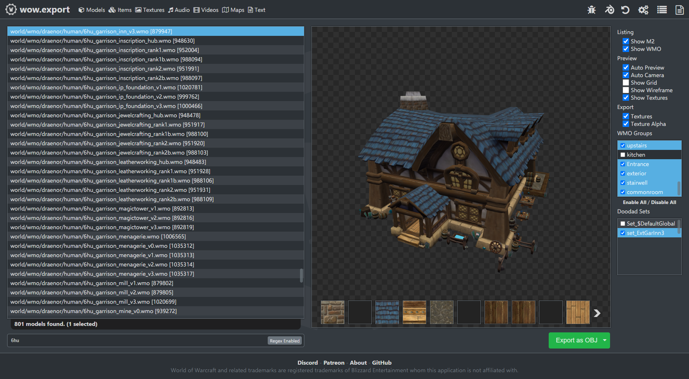
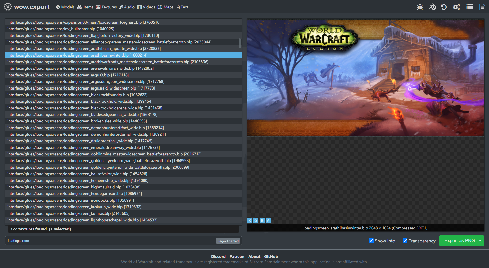
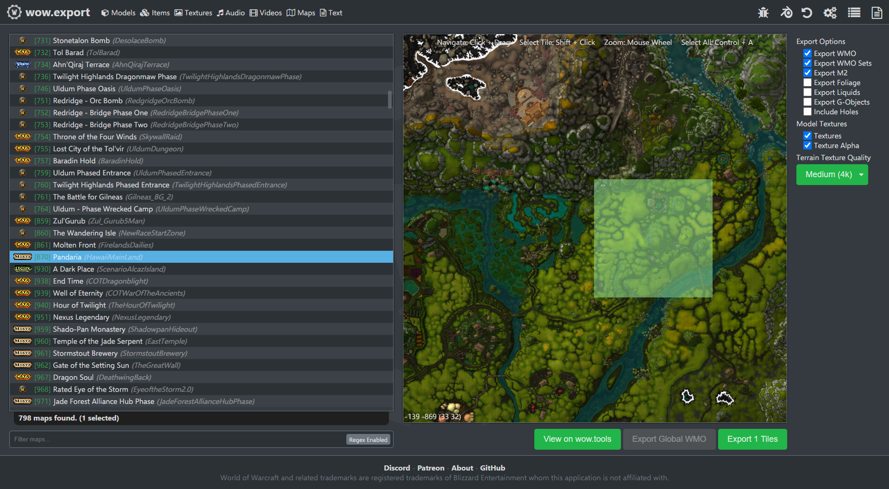
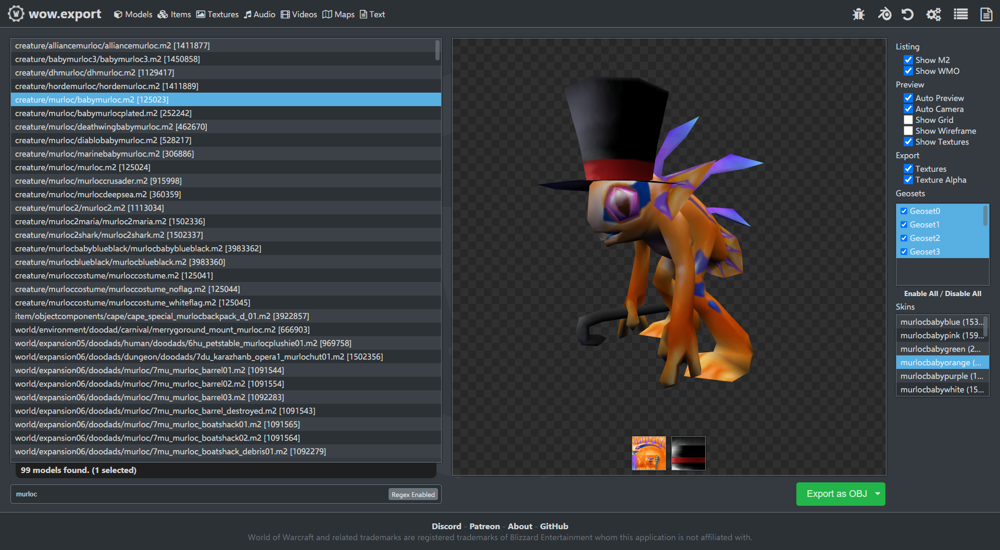

#  wow.export

wow.export is the number one export toolkit for World of Warcraft. Using either an offline local installation or the online Blizzard CDN servers, wow.export allows you to preview models, textures, sound, music, cinematics and much more, and export them to modern formats.

	
	&nbsp;&nbsp;&nbsp;&nbsp;
	

	
	&nbsp;&nbsp;&nbsp;&nbsp;
	

## 📦 Installing

If you're installing wow.export for the first time, check out the [Releases page](https://github.com/Kruithne/wow.export/releases), there you'll find the latest releases for all supported platforms.

	
	&nbsp;&nbsp;&nbsp;&nbsp;
	
	&nbsp;&nbsp;&nbsp;&nbsp;
	

As of 2.0.0, wow.export officially supports Windows, Linux and macOS with builds for both x86 and ARM architecture.

### Available Distributions

| Archive Name | Platform | Architecture |
|--------------|----------|--------------|
| wow_export_win32_x64 | Windows | x64 |
| wow_export_linux_x64 | Linux | x64 |
| wow_export_darwin_x64 | macOS | x64 |
| wow_export_cli_only_win32_x64 \* | Windows | x64 |
| wow_export_cli_only_linux_x64 \* | Linux | x64 |
| wow_export_cli_only_darwin_x64 \* | macOS | x64 |

**\* CLI-Only distributions** are stripped down terminal-only releases ideal for server environments, automation workflows, or users who only need command-line functionality.

## 🔃 Updating

wow.export is a self-updating application. If a new version is released, it will automatically update itself to the newest version on launch.

## 📟 GUI vs CLI

**GUI**: The graphical user interface is the intended desktop user experience for wow.export. It provides an intuitive visual interface for browsing, previewing, and exporting World of Warcraft assets with full mouse and keyboard support.

**CLI**: The command-line interface is designed for terminal users and integration with automated workflows. It provides programmatic access to wow.export's functionality, making it suitable for scripting, batch processing, and server environments.

## 💸 Supporting

The development of this project is officially [supported via Patreon](https://www.patreon.com/c/kruithne). Kruithne provides a number of guides, scripts and additional tools, and in return all funds go directly to supporting development time and server costs for this project.

## ⚙️ Development

If you are looking to build wow.export locally or contribute to the project, take a look at [DEVELOPMENT.md](/DEVELOPMENT.md)