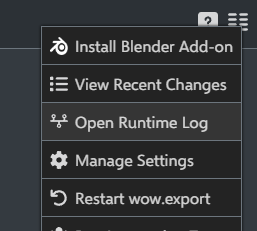

! runtime log errors
# KB001: Accessing the runtime log
When encountering an issue with wow.export, you may be requested to provide the `runtime.log` for diagnostics to help better understand the error. This log file contains debugging information produced from the last run of wow.export, including any errors that may have occurred.

The quickest way to view your runtime log is to click the context-menu in the top-right corner of wow.export and select `Open Runtime Log`.

## Manual Access
There may be situations where you are unable to access this menu - loading loops, crashes, etc. In this scenario, you can find the file manually at the following locations.

**Windows**
`%LOCALAPPDATA%\wow.export\User Data\Default`

**Linux**
`~/.config/wow.export/User Data/Default`

**macOS**
`~/Library/Application Support/wow.export/User Data/Default`

## Privacy
The runtime log provides developers with diagnostic information from wow.export. This will include the path to your user directory, which references your computer username.

No other personal information, nor your networking information such as IP address, is included in the runtime log.