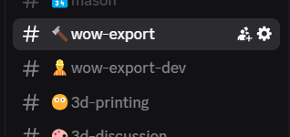

! default support help bug report issues crash
# KB002: Getting Support
The best place to get support for wow.export is the `Tamara's Workbench` community Discord. It's open for anyone to join, simply [click here](::DISCORD) to get an invite. Once joined, look for the `#wow-export` channel.

In addition to the Discord community, the developers of wow.export track on-going issues through the [GitHub issue tracker](::ISSUE_TRACKER). While users are free to submit bug reports here, we ask that you first check the issues has not already been reported, and double-check in the Discord channel first.