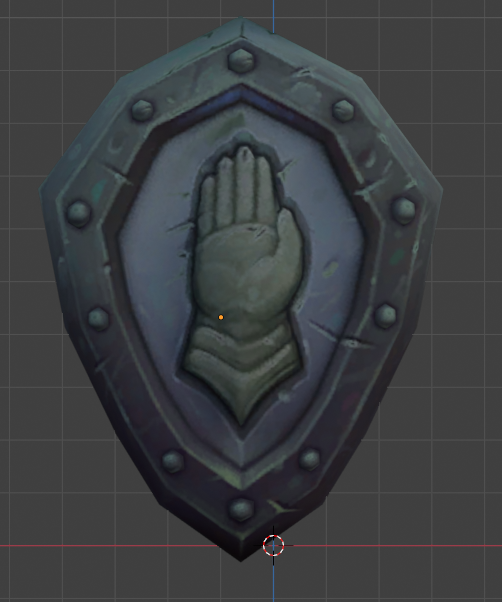

! textures alpha transparency black glitch colour
# KB004: Textures appear incorrectly
When exporting models, a common problem people come across is that the textures appear incorrectly, with black splotches or washed out colours. The reason for this is textures in World of Warcraft often carry non-alpha data in the alpha channel. Most software isn't expecting this, so it assumes the alpha channel is transparency, resulting in the incorrect appearance.

The first step is to disconnect the alpha channel so that it's not being used anymore. In some software, this will have no visible effect, such as Blender.

This is caused by an optimization called alpha pre-multiplication. To bypass this in Blender, you need to set the `Alpha Mode` to `Channel Packed`.

Tip: When importing models using the wow.export Blender add-on, we automatically apply this to all textures.