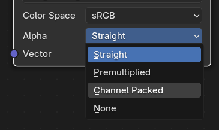

! textures alpha transparency
# KB005: Texture Transparency
When importing models into 3D software, you may experience a lack of transparency as shown in the example of a tree below.

To resolve this, you need to ensure your 3D software is using the alpha channel from the texture.

In Blender, connect the `Alpha` socket from the `Image Texture` node to the `Alpha` socket of the `Principled BSDF` node.

Note: A lot of models in World of Warcraft carry non-transparency data in the alpha channel. For this reason, you should set your `Alpha Mode` to `Channel Packed` on your textures.

Tip: Using the wow.export Blender add-on to import models, all of this is handled for you automatically.