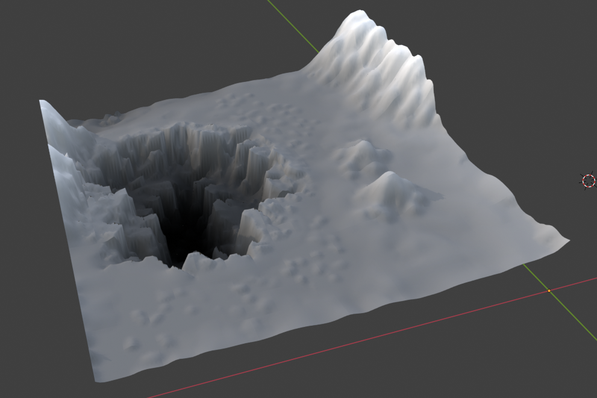
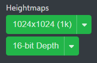
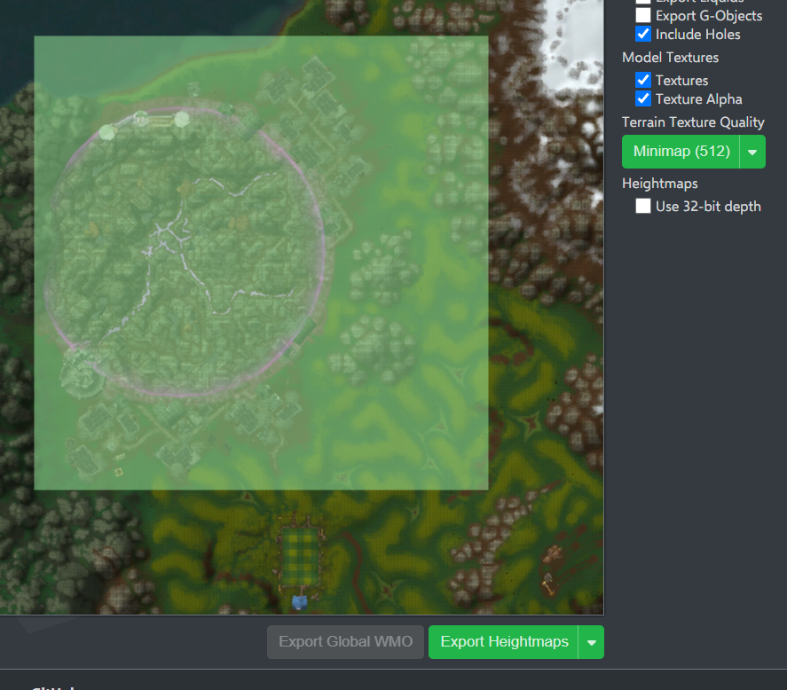
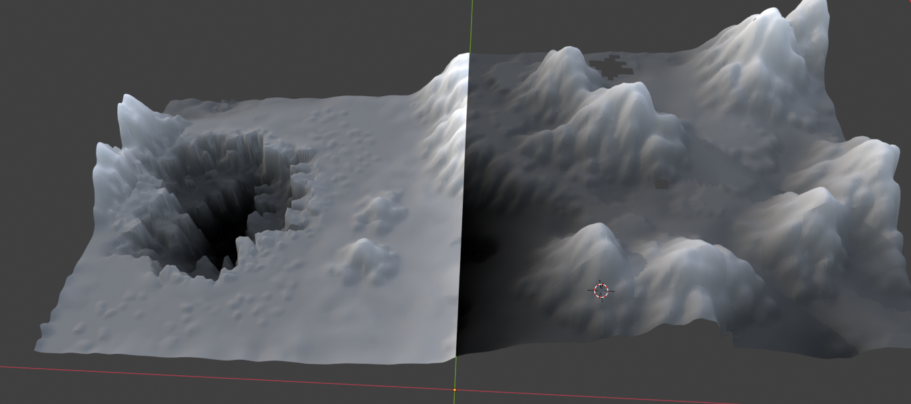
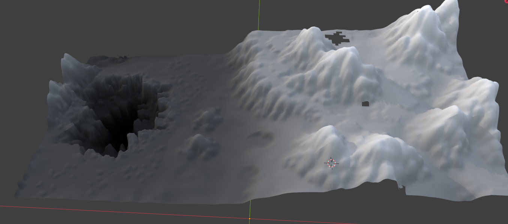

! heightmaps terrain
# KB006: Exporting Terrain Heightmaps
Normally, terrain is exported from World of Warcraft as a piece of geometry. For some 3D software, such as game engines, having a heightmap texture is preferred.

A heightmap is a 2D image where the brightness represents the depth. Black is at the lowest point, and white is as the highest.

To export a heightmap, select one or more tiles in the map viewer and set the export mode to `Export Heightmaps`.

You can control both the `resolution` and the `bit-depth` of exported heightmaps from the sidebar.

Internally, heightmaps are 64x64. The higher resolutions exist for compatibility with other software/engines. Higher resolutions are achieved with bilinear interpolation. This means a higher resolution does not increase quality.

Choose the bit-depth that is supported by your target software:

- 8-bit: grayscale, 1 byte/pixel, 0-255 range
- 16-bit: grayscale, 2 bytes/pixel, 0-65535 range
- 32-bit: RGBA, 4 bytes/pixel, float32 encoded

Exporting at a bit-depth (especially 32-bit) that is not supported by your software will result in unexpected results.

## Global Height Space
Exporting an individual tile, the highest and lowest point will be relative to just that tile. The next tile you export will have a different high and low point. This is `local height space`.

Bringing multiple tiles together in `local height space` results in terrain that does not connect properly.

To ensure that the tiles are exported with `global height space` or at least `relative height space`, ensure that you select all the tiles you want and generate their heightmaps together.

Before exporting, wow.export will iterate over all of the tiles and calculate the absolute highest and lowest points, and scale the heightmaps relative to this, resulting in seamless terrain.

