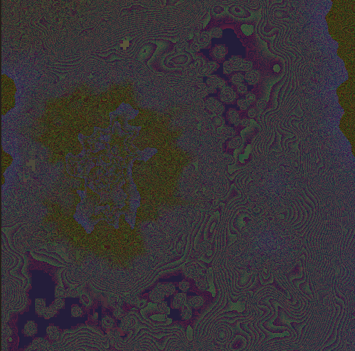

! heightmaps terrain
# KB006: Exporting Terrain Heightmaps
Normally, terrain is exported from World of Warcraft as a piece of geometry. For some 3D software, such as game engines, having a heightmap texture is preferred.

A heightmap is a 2D image where the brightness represents the depth. Black is at the lowest point, and white is as the highest.

To export a heightmap, select one or more tiles in the map viewer and set the export mode to `Export Heightmaps`.

Pay attention to the `Terrain Texture Quality` on the sidebar, as this also controls the dimensions of your heightmap texture.

Note: Higher resolutions are achieved with bilinear interpolation, that does not necessarily increase quality.

## Global Height Space
Exporting an individual tile, the highest and lowest point will be relative to just that tile. The next tile you export will have a different high and low point. This is `local height space`.

Bringing multiple tiles together in `local height space` results in terrain that does not connect properly.

To ensure that the tiles are exported with `global height space` or at least `relative height space`, ensure that you select all the tiles you want and generate their heightmaps together.

Before exporting, wow.export will iterate over all of the tiles and calculate the absolute highest and lowest points, and scale the heightmaps relative to this, resulting in seamless terrain.

## 32-bit Depth
For higher precision, wow.export can export heightmaps using 32-bit depth. This will use all 4 bytes to store the height value as a float32, resulting in extremely fine height variation.

The resulting images will look something like this, which is to be expected.

Be sure your software supports 32-bit float heightmaps before using it, otherwise the results will be unexpected!