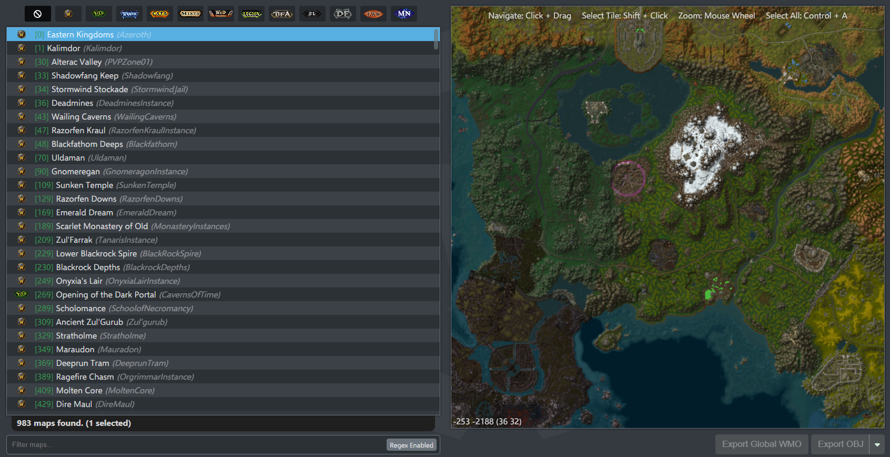
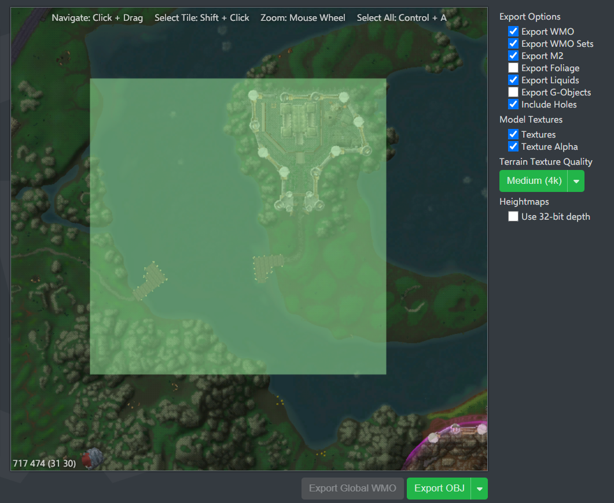
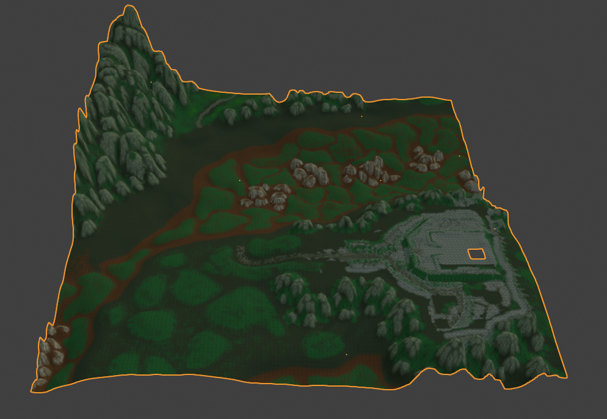
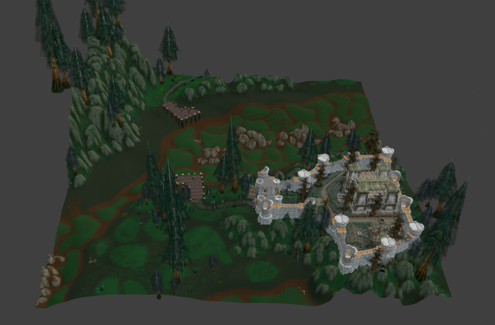
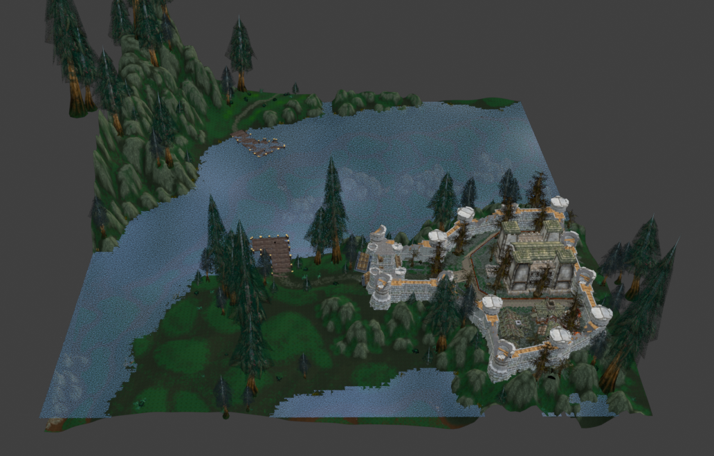
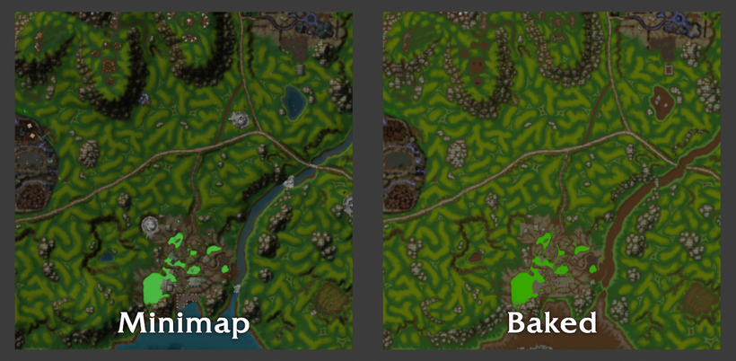
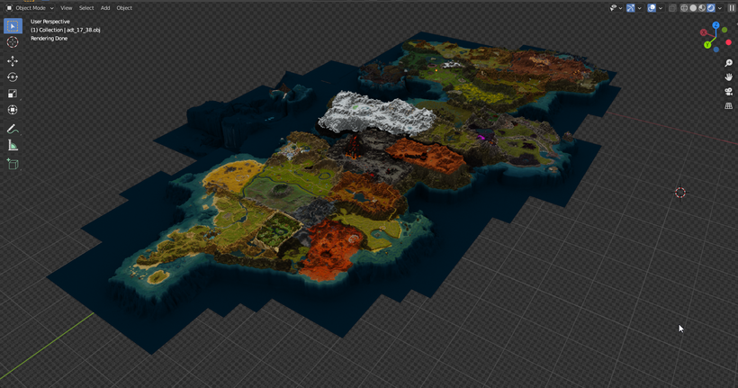
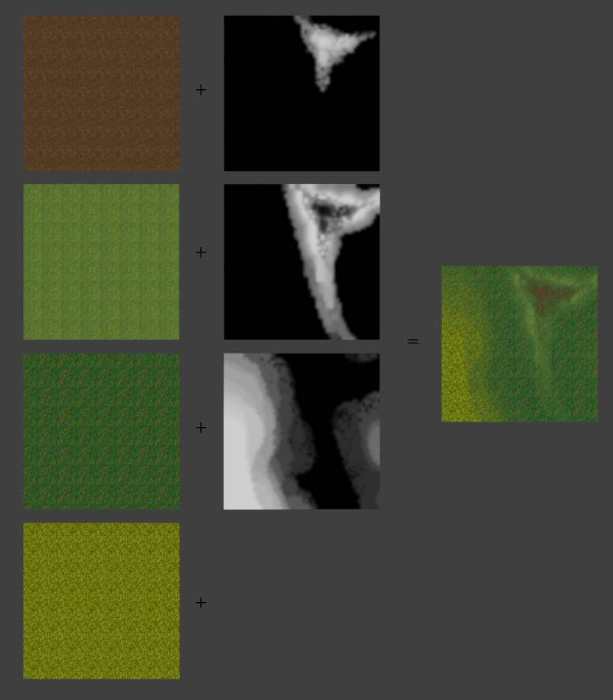
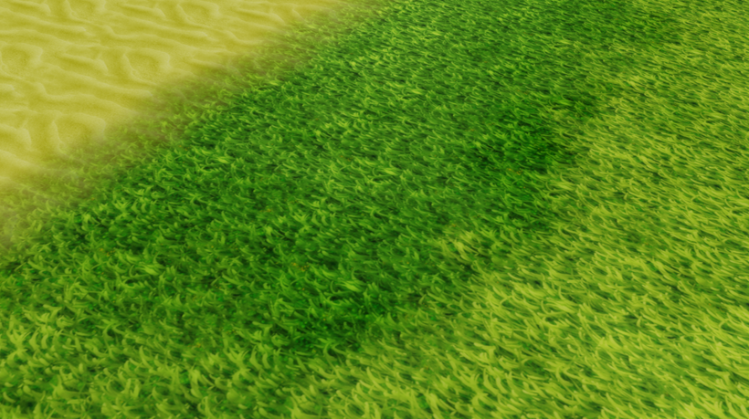

! export maps terrain world
# KB007: Exporting Maps
To export a map (or sections of a map) from wow.export, navigate to the `Maps` tab and find a map of your choosing.

Once selected, you should see an overview of all the tiles available on the map.

At the top of the viewer, you can see the controls for navigating and selecting tiles. Start by selecting one of more tiles of your choice.

On the right-hand side, you'll see numerous options to fine-tune your export.

- **Export WMO**: World Model Objects are larger objects such as buildings or cities, these often contain smaller objects.
- **Export WMO Sets**: World Model Objects have sets of pre-defined objects inside of them. This would be the props inside a building.
- **Export M2**: Map tiles can also have their own individual doodads, such as bushes, fences and other decoration.
- **Export Foliage**: Foliage is the grass and othered scattered ground objects.
- **Export Liquids**: Liquids such as lakes, rivers, oceans, slime, lava, etc.
- **Export G-Objects**: Game objects are interactable objects such as signposts.
- **Include Holes**: Map tiles have holes punched into the terrain which allow players to go underneath, this is used for caves and other passages.

Once exported, you will have an `.obj` file which contains the geometry of your terrain and a corresponding `.mtl` which maps the textures onto it. You can import this into the 3D software of your choice.

## World Models
You may have noticed in the above that we exported the world models (WMO/M2) but they didn't import. These models are exported as individual models, and then mapped onto the terrain via a `ModelPlacementInformation.csv` file.

If you're using Blender, you can use the wow.export Blender add-on to import the terrain `.obj` and it will automatically use this `.csv` file to load in all of the models as well.

Note: If you import the same map tile more than once into the same Blender scene, world models will not be placed. See [KB008](::KB008) for more information.

## Liquids
When exporting liquids, you will find a `liquid_x_y.json` file alongside your terrain files. This defines the liquid planes within the tile.

For Blender users, the wow.export Blender add-on will automatically import these for you.

## Terrain Texture Quality
wow.export offers a number of different quality options for terrain exporting.

### Terrain Baking
`Low (1k)`, `Medium (4k)`, `High (8k)` and `Ultra (16k)` use a pre-baking method where the terrain textures are blended together to produce a finalized PNG for your terrain tile.

For the `Low` and `Medium` options, these are produced as a single texture file. For the `High` and `Ultra` settings, this produces multiple texture files which are mapped together via the UV map in the `.obj` file.

In contrast to the appealing quality names, such as `Ultra`, terrain baking has two major flaws. First, the quality will never match the in-game quality, and secondly the file sizes are considerably large.

Despite this, terrain baking is a suitable option for quickly getting decent terrain exported with textures in a simple fashion.

### Minimaps
In-game minimaps are per-tile textures rendered from a birds eye view in-game.

Despite being small, these contain a lot of detail and are perfect for an optimized far-shot. As such, as offer the option to export terrain using this as a texture.

### Alpha Maps
To render terrain efficiently and at full-resolution, you need to use `alpha maps`. These are small texture masks that define how the different textures layer ontop of each other.

While these are the best option for 1:1 quality and efficiency, they will require some assembly in the 3D software of your choice as they're not natively supported. For a technical breakdown of how to do this, see [KB010](::KB010).

For those using Blender, the wow.export Blender add-on will automatically setup alpha maps for you, allowing you to get 1:1 in-game quality terrain in a single click.

