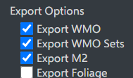
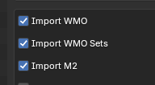

! terrain map empty blender
# KB008: Map Tile Empty (Blender)
If you've tried to import a map tile into Blender and found there are no models (buildings, fences, etc) on it, there are a few things to check.

## Step 1: Exporting
Before doing anything else, ensure that you exported the tile with the correct settings checked.

- **Export WMO**: This exports large models such as buildings or cities.
- **Export WMO Sets**: This includes models inside buildings, such as interior props.
- **Export M2**: This includes tile decoration such as fences, trees, bushes, etc.

## Step 2: Importing
When importing into Blender, make sure you are using the wow.export Blender add-on.

On the import dialog, check the left-hand side and ensure that you have the correct import options checked.

## Step 3: ADT Duplication
If all of the above has failed, you may be experiencing duplication protection.

**Boring Explanation Starts Here (Skip Ahead)**

Some models in the game, especially larger ones such as buildings or cities, often overlap onto multiple tiles. Let's use Stormwind City as an example, this overlaps hundreds of tiles.

Every tile which the model touches includes that model as a model on itself. Since tiles load/unload as you fly through the world, the game needs to make sure large models, such as Stormwind City, are visible from whatever direction you fly in from, and don't disappear when you're far enough away from a specific tile.

Because of this, Stormwind City appears on hundreds of tiles. If we imported every model on the tiles you import, Elwynn Forest would result in 300+ copies of the city - and this would happen in-game too!

To resolve this, each instance of a model has a unique ID. As you fly through the game, it skips loading any model that's already loaded, using that ID. We do the same thing in our Blender add-on. If a specific model ID has already been loaded, we skip it.

This becomes a problem if you import a map tile, delete it, and then try to re-import it again.

**Boring Explanation Over - Solution Here**

In this scenario, you have two options. Create a new Blender scene and import it again, or enable the `Allow Duplicates (ADT)` option on the import dialog and re-import it.