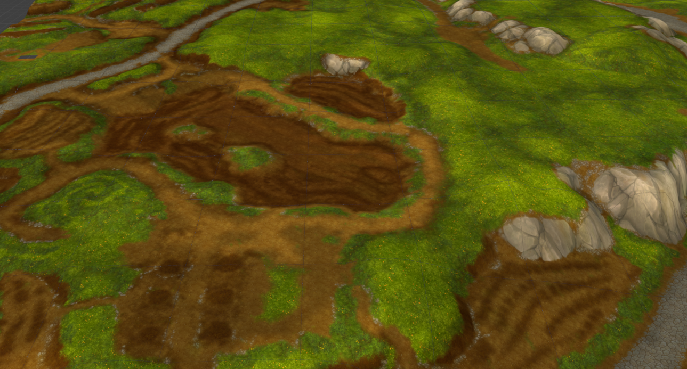
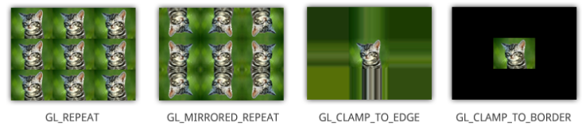
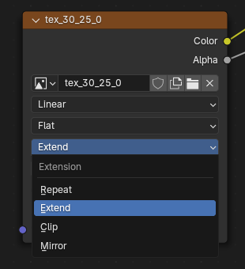

! terrain texture seams map
# KB009: Seams on Map Tiles
When importing map tiles into the software of your choice, you may encounter an issue where you see seams between the individual chunks on the tile, as shown in the image below.



To resolve this, you need to ensure the software of your choice is extended the edge of the textures infinitely outward. 

This is referred to as the `Extension`, `Wrap`, `Tiling` or `Address` mode across different software. The specific mode we need is referred to as `Extend` or `Clamp to Edge`.



To set this in Blender, select the `Image Texture` node in your shader graph and set the `Extension` to `EXTEND`.



A terrain tile normally comes with 256 tiles, making this process time-consuming especially on more than one tile. Within Blender, you can automate this using the following Python code.

```
import bpy

for obj in bpy.context.selected_objects:
    if obj.material_slots:
        for slot in obj.material_slots:
            material = slot.material
            if material and material.use_nodes:
                for node in material.node_tree.nodes:
                    if node.type == 'TEX_IMAGE':
                        if node.image:
                            node.extension = 'EXTEND'
```

Tip: You can import terrain using the wow.export Blender add-on and it will automatically detect and apply the correct extension mode.