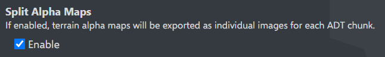
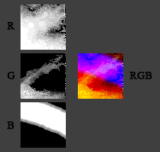

! alpha maps terrain blending shader
# KB010: Rendering Alpha Maps
Terrain in World of Warcraft is rendered using `alpha maps`. This article is going to walk through how to set these up for rendering.

WARNING: It's important to note that this is a complicated process not intended for inexperienced users. wow.export does offer simpler methods of exporting terrain, such as pre-baking, outlined in [KB007](::KB007).

BLENDER USERS: The wow.export Blender add-on automatically sets up this shader for you if you import ADT terrain using it.

### Exporting Alpha Maps

To export terrain with alpha maps, change the `Terrain Texture Quality` to `Alpha Maps`.

A terrain tile is made up of 256 chunks. By default, wow.export is going to export each chunk as *at least* 2 files - an alpha map image and a JSON metadata.

If you desire the alpha map channels to be compacted into a single image, disable the `Split Alpha Maps` option in settings.



Note: This may result in more than one image due to variable layer counts. See below.

An alpha map is a 64x64 mask which dictates how a specific layer (texture) is painted onto the terrain. These are stacked together and computed with height data to produce the final terrain.

For efficiency, wow.export combines these masks into fewer images by placing one layer in each channel of the output image.



NOTE: As of Midnight, terrain can now have more than 3 layers. We compact this into one or more images using the `Red`, `Green`, `Blue` and `Alpha` channels of each image.

### Using Alpha Maps

To render the terrain using alpha maps, you will need to load the exported alpha map textures, the specular (_s) and height (_h) textures, and the JSON metadata for each tile.

With this data, you can now begin constructing the terrain via a shader.

Inputs (per layer 0-7):

diffuse_{i}     : Color texture
height_{i}      : Height/displacement map
alpha_{i}       : Blend weight (layers 1-7 only)
height_scale_{i} : Height multiplier
height_offset_{i}: Height bias

Alpha Map Structure:

Alpha Map 0: tex_30_25_0.png
├── Red   → alpha_1
├── Green → alpha_2
├── Blue  → alpha_3
└── Alpha → alpha_4

Alpha Map 1: tex_30_25_0_1.png (if >4 layers)
├── Red   → alpha_5
├── Green → alpha_6
├── Blue  → alpha_7
└── Alpha → (unused)

1. Base Layer Weight Calculation:

```
alpha_sum = alpha_1 + alpha_2 + alpha_3 + alpha_4 + alpha_5 + alpha_6 + alpha_7
alpha_sum_clamped = clamp(alpha_sum, 0.0, 1.0)
base_weight = 1.0 - alpha_sum_clamped
```

2. Per-Layer Height Modulation:

```
FOR each layer i (0-7):
	height_modulated = height_{i} * height_scale_{i} + height_offset_{i}

	IF i == 0:
		layer_weight = base_weight
	ELSE:
		layer_weight = alpha_{i}

	layer_pct = layer_weight * height_modulated
```

3. Competitive Suppression:

```
max_pct = MAX(layer_pct[0], layer_pct[1], ..., layer_pct[7])

FOR each layer i:
	diff = max_pct - layer_pct[i]
	diff_clamped = clamp(diff, 0.0, 1.0)
	suppression_factor = 1.0 - diff_clamped
	suppressed_pct[i] = layer_pct[i] * suppression_factor
```

4. Normalization:

```
total_suppressed = SUM(suppressed_pct[0] + ... + suppressed_pct[7])

FOR each layer i:
	normalized_pct[i] = suppressed_pct[i] / total_suppressed
```

5. Final Color Blending:

```
final_color = (0,0,0)

FOR each layer i:
	weighted_color = diffuse_{i} * normalized_pct[i]
	final_color += weighted_color
```